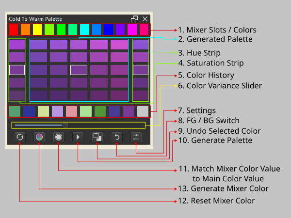
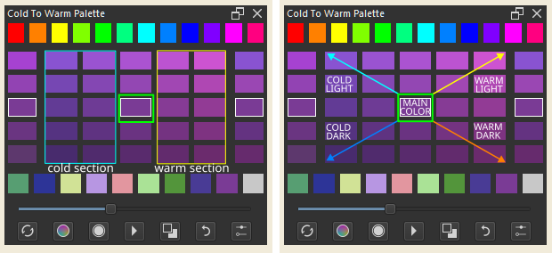
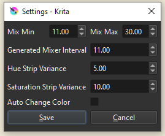

# Cold to Warm Palette Maker

A plugin for [Krita](https://krita.org).

## What is Cold to Warm Palette Maker? 

*Cold to Warm Palette Maker* is a Python plugin made for [Krita](https://krita.org) (free professional and open-source painting program). 

This plugin allows one to generate cold to warm tone palette of a given foreground color as well as mix said color to one of the color in the color mixer section. 

---

## ScreenShots 

### *Interface* 

Interface Adjust Depending on the ratio of height and width of the button

  
 
*Interface Parts*

  

1. Mixer Slots 
    
> Colors that can be used to mix together with any of the colors in the Generated Color Palette Slot. 

- Default colors are set to 30° interval starting from red. 
- New batch of colors can be generated using the generate mixer color button
- or set to current foreground color by right clicking the chosen slot 

|  Keys  |  Action  | 
| --- | ---  | 
| LMB | Mix color in the Slot to the Main in the Generated Palette
| RMB | Set color of the slot to current foreground color

2. Generated Palette 

> The generated Cold to Warm Palette , divided to 5 section. 

>   

- The Main Color is highlighted in the center
- The left side of the palette is the cold tone section
- The right side of the palette is the warm tone section
- From middle to top left are cold light color
- From middle to bottom left are the cold dark color
- From middle to upper right are the warm light color
- from middle to bottom right are the warm dark color
- selecting a new foreground color will not auto regenerate this palette 

|  Keys  |  Action  | 
| --- | ---  | 
| LMB | Set Foreground Color to this Color
| RMB | Set Background Color to this Color

3. Hue Strip

> Contains variation of Hue based off the main color  

>   

|  Keys  |  Action  | 
| --- | ---  | 
| LMB | Set Foreground Color to this Color
| RMB | Shift Main Color to this Color

4. Saturation Strip

> Contains variation of Saturation based off the main color  

>   

|  Keys  |  Action  | 
| --- | ---  | 
| LMB | Set Foreground Color to this Color
| RMB | Shift Main Color to this Color

5. Color History 
 
> Contains previously selected main colors

>   

|  Keys  |  Action  | 
| --- | ---  | 
| LMB | Set Foreground Color to this Color
| RMB | Shift Main Color to this Color

6. Settings 
>  
 
> Mix Min and Mix Max 
- Govern the interval between Main Color to Mixer Color 
- Same Value for Mix and Max will make it fix interval from one color to another 
- Lower value more steps to get to mixer color
- Higher value lesser steps to get to mixer color

> Generated Mixer Interval
- The gap between each 3 color set in randomly generated mixer color

> Saturation and Hue Strip Variance
- Sets the variance between Saturation/Hue Strip Colors
 

|  Keys  |  Action  | 
| --- | ---  | 
| LMB | Set Foreground Color to this Color
| RMB | Shift Main Color to this Color

7. Slider and Buttons 

>  

|  Button  |  Name | Action  | 
| --- | ---  | --- |
| 1 | Color Variance Slider | Controls the gap between colors generated in the palette.  
| 2 | Reset Mixer           | Reset colors in mixer bar to default mixer colors.
| 3 | Generate Mixer        | Generate NEW set of mixer colors.
| 4 | Mixer to Value        | Match the color value of mixer colors to that of the main color.
| 5 | Generate Palette      | Generate Cold to Warm Palette based off of foreground color
| 6 | Switch FG/BG          | Switch foreground and background color
| 7 | Undo                  | Undo Main Color / select previous main color
| 8 | Settings              | Open Settings Dialog 
### Functionalities

This plugin main function are 
1. Create a cold and warm tone palette from foreground color
2. Mix generated palette with a color from color slot

> [Cold to Warm Palette Demo Video ](https://www.youtube.com/watch?v=sCc7H0TAslQ)

### Plans --

### Bugs and Known Issues

1.   

## Downloads - Install - Execute 

### Download
- **[ZIP](https://github.com/kaichi1342/ColdToWarmPalette/archive/refs/heads/v.0.1.3a.zip)**
- **[Source](https://github.com/kaichi1342/ColdToWarmPalette)**

### Install

1. Open [Krita](https://krita.org)
2. Got to Tools -> Scripts -> **Import Python Plugins** and select 
**ColdToWarmPalette.zip** archive. 
3. Restart [Krita](https://krita.org)
4. Make sure Cold to Warm Palette is enabled in Plugin Manager. 
if not enable it by going to Settings -> Configure Krita -> **Python Plugin Manager** and click to check **Cold to Warm Palette**.
5. Restart Krita.
6. View **Cold to Warm Palette** to your screen by going to Settings -> Dockers -> **Cold to Warm Palette**
 
### Tested Platforms
- Krita 5.1.5
- Krita 5.2 beta 1

### Release Log
2024-11-02  : Version 0.1.3a
- Fix no plugin error when importing plugin

2024-09-09  : Version 0.1.3
- Fix float error in python 3.10 / 3.12
- Change doublespinbox precision to 0 to prevent float value

2023-09-09  : Version 0.1.2c

- Change setupColor to use MangeColor.fromQcolor

2023-08-21  : Version 0.1.2b

- Quick Bug Fix Version on Red Color Mixing

2023-08-20  : Version 0.1.2a

- Remove color variance setting from Setting Dialog
- Added color variance slider to main dialog 
- Added color history bar
- Added ability to return to previous selected main color 
- Added [Auto Change] setting to setting dialog
- Added ability to change selected main color to current foreground color automatically via toggle in settings dialog
- Added ability to change mixer color value to match that of main color value

2023-07-30  : Version 0.1.1a

- First Released Version 

### Thanks to:
This docker is a request from krita comunity                

## License

### *Cold to Warm Palette* is released under the GNU General Public License (version 3 or any later version).

*Cold to Warm Palette* is free software: you can redistribute it and/or modify 
it under the terms of the GNU General Public License as published by
the Free Software Foundation, either version 3 of the License, or
(at your option) any later version.                               
    
*Cold to Warm Palette* is distributed in the hope that it will be useful,
but WITHOUT ANY WARRANTY; without even the implied warranty of
MERCHANTABILITY or FITNESS FOR A PARTICULAR PURPOSE.
See the GNU General Public License for more details.

You should have received a copy of the GNU General Public License
along with this program. If not, see https://www.gnu.org/licenses/                                   

                            
 
